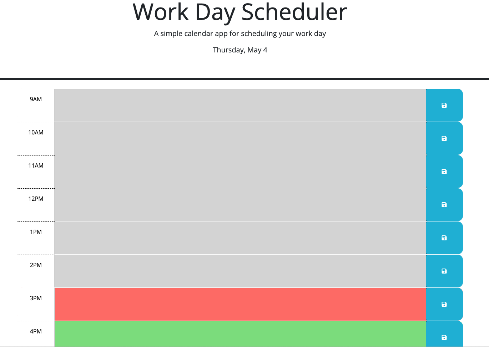

# Work Day Scheduler
> This is a simple daily calendar application that allows users to save events for each hour of the day.
> Live demo [_here_](https://kristinehkim.github.io/work-day-scheduler/). <!-- If you have the project hosted somewhere, include the link here. -->

## Table of Contents
* [General Info](#general-information)
* [Features](#features)
* [Screenshots](#screenshots)
* [Setup](#setup)
* [Usage](#usage)
* [Project Status](#project-status)
* [Room for Improvement](#room-for-improvement)
* [Acknowledgements](#acknowledgements)
* [Contact](#contact)
<!-- * [License](#license) -->

## General Information
This app runs in the browser and features dynamically updated HTML and CSS powered by jQuery.  The Day.js library is used for date and time in this app.  The current day is displayed at the top of the daily planner.  There are timeblocks for each hour of standard business day (9am-5pm).  Each timeblock is color coded to indicate the past hours in gray, the present hour in red, and future hours in green.  When the used clicks in a timeblock, the user can type in an event and click the save button for that timeblock.  When the user refreshes the page, the events persist.
<!-- You don't have to answer all the questions - just the ones relevant to your project. -->

## Features
- Current date always displayed at the top of the calendar
- Text for each event saved in localStorage
- Color coded timeblocks displaying past, present, or future hours
- Colors will adjust as the day progresses

## Screenshots

<!-- If you have screenshots you'd like to share, include them here. -->

## Setup
The app is run using Bootstrap, jQuery, and Day.js.  There are a lot of notes commented out so I or anyone else can go back to this code and deeply understand what is going on.

## Usage
The user can type in each timeblock and click the save button for the corresponding block.  It will save even when the page is refreshed and can be edited.

## Project Status
Project is: _in progress_ 

## Room for Improvement
Room for improvement:
- To update color coded blocks by the hour on its own without being refreshed

## Acknowledgements
Many thanks to my instuctor, Michael Pacheco, the TAs, Nirav Venkatesan and Julius Dorfman, and tutor, Dane Shrewsbury. Also, to all the Ask BCS people that helped me!

## Contact
Created by Kristine Kim.  Feel free to email me at kristinehkim@gmail.com. 

<!-- Optional -->
<!-- ## License -->
<!-- This project is open source and available under the [... License](). -->

<!-- You don't have to include all sections - just the one's relevant to your project -->